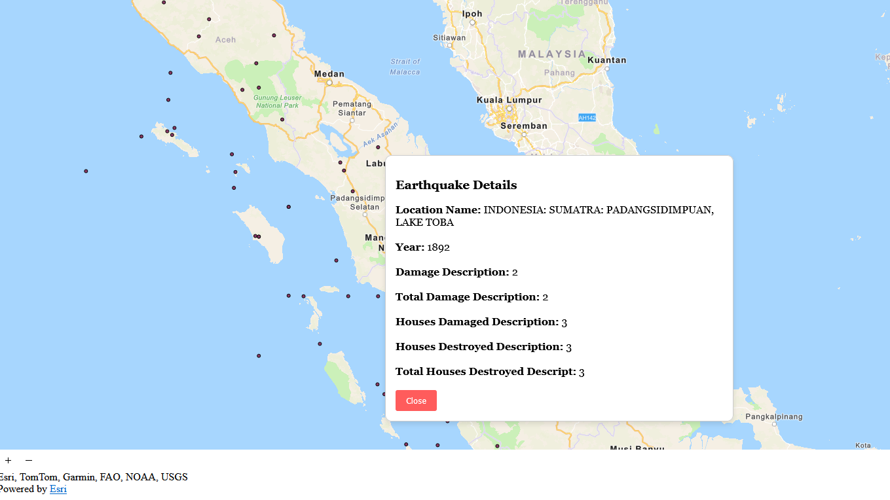

# Earthquake Map 🌍

An interactive web based GIS application that visualizes earthquake data using the ArcGIS API for JavaScript.

## Features 🚀

- Displays certain real-time and historical earthquake data on an interactive map.
- Clickable markers show detailed earthquake information in a popup.
- Zooming for better visualization.
- Uses **ArcGIS API for JavaScript** for rendering map layers.

## Screenshot 📷



## Technologies Used 🛠️

- **ArcGIS API for JavaScript** – for rendering maps.
- **HTML, CSS, JavaScript** – core web technologies.

## Setup & Installation 🔧

1. Clone the repository:

   ```sh
   git clone https://github.com/arcenter/interactive-earthquake-gis.git
   ```

2. Navigate to the project folder:

   ```sh
   cd interactive-earthquake-gis
   ```

3. Open `index.html` in a web browser.

## Usage 🎯

- Click on an earthquake marker to view details.
- Zoom in/out and pan to explore different regions.
- Modify the **JavaScript code** to customize popups or add new features.

## Live Demo 🌍

Visit the page with its [Live Demo](https://arcenter.github.io/interactive-earthquake-gis/).

## To-Do / Future Improvements 📝

- [ ] Add search functionality for locations.
- [ ] Implement filtering by date/magnitude.
- [ ] Improve UI with better styling.

## Contributing 🤝

Pull requests are welcome! If you'd like to contribute, feel free to fork the repo and submit a PR.

## License 📜

This project is licensed under the **MIT License**.